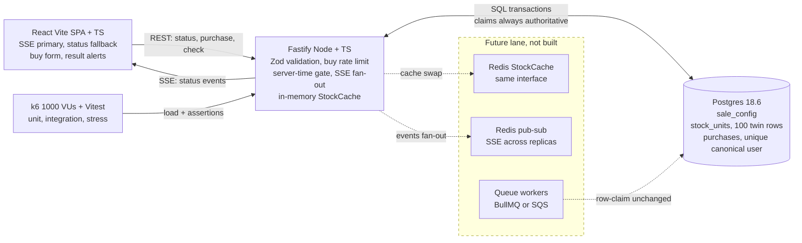

# Bookipi Flash Sale

TL;DR: 1,000 buyers fight for 100 units, every claim runs through Postgres, and the count lands at exactly 100 sold with zero oversell.

> Repo: https://github.com/naufalmalikr/bookipi-flash-sale

## Prerequisites

- Docker + `docker compose` (engine running, ports 3001, 5173, 5432 free).
- Node `26.10.0` (see `.nvmrc`; `node --version` should print `v26.10.0`).
- k6 via Docker only, no local install needed (`grafana/k6` image, see Stress).
- A POSIX shell with `curl` for the checks below.

## Quickstart (reviewer path)

From a cold clone, one command brings up Postgres + backend + frontend:

```sh
cp .env.example .env && docker compose up --build -d
```

Time rule: `SALE_START` / `SALE_END` must be UTC ISO-8601 with a trailing `Z`
(e.g. `2026-09-23T07:40:00Z`). Offsets like `+02:00` or naive datetimes are
rejected at backend boot. You'll find a generator snippet in `.env.example`.

Then confirm each layer is green:

```sh
curl -s localhost:3001/health            # expect {"ok":true}
curl -s localhost:3001/api/sale/status   # expect status + stockRemaining shape
curl -s -o /dev/null -w "%{http_code}\n" localhost:5173/   # expect 200
```

Smoke purchase (fresh seed: 201; on a consumed DB expect `409 sold-out`):

```sh
curl -s -X POST localhost:3001/api/purchase \
  -H 'Content-Type: application/json' \
  -d '{"userId":"you@example.com"}'
# fresh DB: 201 {"result":"purchased","unitId":<n>}

curl -s localhost:3001/api/purchase/you%40example.com
# 200 {"result":"purchased","unitId":<n>} or 404 {"error":"not-purchased",...}
```

Live updates stream over SSE (open in a second terminal, then buy):

```sh
curl -N localhost:3001/api/sale/events
# event: status JSON on purchase + window change + ~2s tick, plus :heartbeat comments
```

Stop without wiping proof data: `docker compose stop` (don't use `down -v`,
it deletes the Postgres volume that holds the stress proof).

## Local dev paths

Compose is the supported path, though both apps also run on the host.
Postgres stays in Docker either way (host port `5432` is mapped, so
host-side code can reach it at `localhost:5432`).

```sh
docker compose up --build -d          # full stack
docker compose logs -f backend        # backend logs
npm --prefix backend run dev          # host backend (needs PG up + DATABASE_URL at localhost)
npm --prefix frontend run dev         # host Vite dev server
npm --prefix frontend run build       # production frontend build check
```

Env knobs (`SALE_START`, `SALE_END`, `STOCK_QTY`, `DATABASE_URL`, `PORT=3001`,
`RATE_LIMIT_BUY=10`, `PG_POOL_MAX=50`, `VITE_API_URL`) are documented in
`.env.example`. The frontend talks to the backend through `VITE_API_URL`
with a Vite dev proxy fallback to `localhost:3001`.

## API contract

All errors share one envelope: `{ "error": "<code>", "message": "<human>" }`.
The frontend renders these codes verbatim.

| Method & path | Body / params | Success | Failures |
|---|---|---|---|
| `GET /api/sale/status` | none | `200 { status: upcoming\|active\|ended, stockRemaining, totalStock, startsAt, endsAt, serverTime }` | never 4xx (initial load + SSE fallback) |
| `GET /api/sale/events` | SSE (`text/event-stream`) | `200` stream of `event: status` JSON (same shape as status) + `:heartbeat` comments | client reconnects with backoff, falls back to status polling (max every 5s) |
| `POST /api/purchase` | `{ "userId": "email" }` (Zod-validated, canonicalized) | `201 { result: "purchased", unitId }` | `400 invalid-userId`, `403 sale-not-active`, `409 already-purchased`, `409 sold-out`, `429 rate-limited` |
| `GET /api/purchase/:userId` | canonicalized path param | `200 { result: "purchased", unitId }` | `400 invalid-userId`, `404 not-purchased` |

Extra rules worth knowing: window checks use backend server time (ISO-8601 UTC),
so skewed client clocks can't sneak in. `POST /api/purchase` needs no
idempotency-key header because per-user uniqueness already makes it idempotent
(a repeat buy returns `409 already-purchased`).

> Buyer identity is unauthenticated: `POST /api/purchase` accepts any email
> with no ownership proof, so per-email uniqueness is a denial-of-purchase
> primitive in production — anyone can buy as `victim@example.com` (the real
> owner then gets `409 already-purchased`) or mint throwaway addresses to
> drain stock. Accepted for this take-home (the k6 proof only needs the
> uniqueness mechanism); a real sale must add verification (OTP / magic link /
> Turnstile) before relying on it.

## Design choices and trade-offs

Correctness lives in Postgres transactions, not in app memory. Any number of
Fastify replicas could share the same claim protocol, since the database
serializes claims. That single idea drives the rest.

| Choice | What we did | Why, and what we gave up |
|---|---|---|
| Row-per-unit claim vs single counter | Each unit is its own row in `stock_units`; a buy claims one row with `SELECT ... FOR UPDATE SKIP LOCKED LIMIT 1`, then `UPDATE sold` + `INSERT purchase` in one transaction | Spreads contention across 100 rows instead of hammering one hot `qty` row. A counter (`UPDATE stock SET qty = qty - 1 WHERE qty > 0`) would be simpler and still correct, but it serializes on one row and shows less under load. Oversell is structurally impossible here: sold rows can never exceed seeded rows. |
| `SKIP LOCKED` vs plain `FOR UPDATE` | Claim skips rows locked by concurrent transactions and takes an unlocked twin; `sold-out` only when zero rows come back | Under 1,000-way contention requests fail fast to `409` instead of piling up behind locks. Plain `FOR UPDATE` would be correct yet slow, with latency pile-up and timeouts at high VU counts. |
| `StockCache` (TTL 5s + invalidate) | `GET /api/sale/status` serves `stockRemaining` through an in-memory cache behind a `getStatus/setStatus/invalidate` interface; every purchase commit invalidates it | Status reads cost one `COUNT` per 5s window instead of one per poll. The claim path never touches the cache, it always hits Postgres authoritatively, so stale reads can't oversell. Swapping to Redis later means reimplementing the same interface. |
| SSE vs WebSocket vs polling | `GET /api/sale/events` pushes `event: status` on each purchase commit, window transition, and ~2s tick; `EventSource` in the SPA with status-poll fallback | Sale updates flow server to client only, so bidirectional sockets add nothing. Plain 3s polling at 1,000 users would burn ~333 rps just for status; one `COUNT` per tick now serves every connected client. |
| Gmail canonical, backend-authoritative | `canonicalizeUserId()` trims and lowercases; Gmail only (`gmail.com`/`googlemail.com`): strip dots, strip `+tag`, fold `googlemail.com` to `gmail.com`. Raw email is kept for audit; the UNIQUE constraint sits on the canonical form | `foobar@gmail.com`, `foo.bar@gmail.com`, `foobar+baz@gmail.com` count as one buyer (second try gets `409 already-purchased`), while `u.s.e.r@outlook.com` stays distinct from `user@outlook.com`. The frontend must not strip dots or tags itself; curl and k6 callers get identical enforcement because the backend owns the rule. |
| Rate limit, buy route only | `@fastify/rate-limit` on `POST /api/purchase`: 10 req/min/IP by default (`RATE_LIMIT_BUY`), `429 { error: "rate-limited" }`; status/SSE routes unlimited | The hot path gets abuse protection without throttling status reads. For k6 the limit is disabled at boot (`RATE_LIMIT_BUY=0`, see Stress) because all VUs share one source IP; production compose omits the override so the default applies. |
| No Redis, no queue, no WS server | Postgres-only compose: `postgres` + `backend` + `frontend`. In-memory `StockCache` and `EventEmitter` inside the single backend process | One-command review with no extra setup, and the row-lock model already serializes claims, so Redis would add cost without adding safety. Timeout/reclaim logic isn't needed either: a crashed claim rolls back and its row stays `available`. Redis, pub/sub, and queues stay as a documented future lane (see diagram + Scaling). |

## System diagram



Solid boxes are what runs today. The dashed lane is docs-only: Redis would
replace the in-memory cache behind the same interface, pub/sub would fan SSE
across replicas, and queue workers would smooth bursts while keeping the
row-claim protocol untouched.

## Pinned versions

Lockfile pins the exact resolved tree (`package-lock.json`); images are pinned
by tag, never `latest`. These numbers were read from the lockfile at doc time,
so any drift means the doc is stale, not the build.

| Component | Pinned version |
|---|---|
| Node (`.nvmrc`, `engines`, Docker base) | `26.10.0` (`node:26.10.0-alpine`) |
| Postgres (compose image) | `18.6-alpine` |
| Fastify | `5.12.5` |
| `@fastify/rate-limit` | `11.2.0` |
| `@fastify/cors` | `11.3.0` |
| Zod | `4.6.5` |
| `pg` driver | `8.23.0` |
| Vite | `8.3.0` |
| React / React DOM | `19.3.0` |
| TypeScript | `7.0.2` |
| Vitest | `5.0.1` |
| k6 (proof run) | `k6 v2.3.0` (Docker `grafana/k6`) |

## Tests

Unit suites cover canonicalization vectors, window-gate boundaries, error-code
mapping, and Zod schemas. Integration suites run against real Postgres 18.6 in
Docker: lifecycle (`upcoming` to `active` to `ended`), Gmail-variant `409`,
sold-out path, SSE delivery on purchase, and a 5-stock/50-parallel exact-5
probe (exactly 5 `201`s, `sold <= 5`, uniqueness holds).

```sh
npm --prefix backend run test              # unit, 7 files / 46 tests green
npm --prefix backend run test:integration  # integration vs real PG, 6 tests green
```

The exact-5 probe is the small-scale twin of the stress proof: 50 parallel
`POST /api/purchase` calls against `STOCK_QTY=5` must yield exactly five
`201 purchased` responses, with the rest `409 sold-out` and no duplicate
canonical users or unit ids.

## Stress (k6): 1,000 VUs vs 100 units

Full method, bypass rationale, thresholds note, and verification SQL live in
`stress/README.md`; the script is `stress/purchase-spike.js`. Short form: VUs
ramp 0 to 200 (20s), to 1,000 (30s), hold 1,000 (30s), ramp down (10s), about
90s total inside a 10-minute ACTIVE window seeded with `STOCK_QTY=100` and
booted with `RATE_LIMIT_BUY=0` (single-NAT VUs share one IP, so the default
10/min limit would measure the limiter, not the claim path).

```sh
SALE_START=$(date -u -d '-1 min' +%Y-%m-%dT%H:%M:%SZ) \
SALE_END=$(date -u -d '+10 min' +%Y-%m-%dT%H:%M:%SZ) \
STOCK_QTY=100 RATE_LIMIT_BUY=0 \
docker compose up --build -d backend

docker run --rm --network host --user "$(id -u):$(id -g)" \
  -v "$PWD/stress:/scripts" \
  -e K6_TS="$(date +%s%N)" \
  grafana/k6 run --out json=/scripts/results.json /scripts/purchase-spike.js
```

Expected outcome (copied from `stress/results-summary.json`, the committed
proof census; raw `results.json` is ~470MB and git-ignored, reproducible via
the commands above):

- HTTP census: **100 x `201`** + **124,884 x `409`** + **0 other**
  (124,984 requests total; every non-201 is post-exhaustion `sold-out`).
- DB counts: `purchases == 100`, `sold == 100`
  (`SELECT count(*) FROM purchases` and
  `SELECT count(*) FROM stock_units WHERE status='sold'`).
- Uniqueness: 0 duplicate canonical user ids, 0 duplicate unit ids,
  100 distinct buyer emails.
- k6: exit 0, `checks` 249,968/249,968 pass (`rate>0.99` gate);
  `http_req_failed` ~0.9991 is informational only (k6 flags expected 409s).

Current repo state: the durable k6 proof is `stress/results-summary.json`
(census: HTTP 100 x `201` + 124,884 x `409` + 0 other; DB `purchases == 100`,
`sold == 100`; 0 duplicate canonical users / unit ids; 100 distinct emails;
k6 exit 0, `checks` 249,968/249,968). The live Postgres volume is ephemeral
(`down -v` wipes it; integration runs reseed it) — treat the summary JSON +
`.omo/evidence/task-14-flash-sale-build.log` as the durable record, not the
container's current rows. A fresh reviewer run reproduces the numbers from a
clean seed instead.

## Scaling path (documented, not built)

Single backend instance is plenty for this take-home. When traffic grows
toward 100x, the plan stays docs-only and keeps Postgres as the source of
truth for claims:

- Implement `StockCache` on Redis behind the same interface.
- Replace the in-memory SSE `EventEmitter` with Redis pub/sub so events fan
  out across Fastify replicas.
- Optionally add a queue (BullMQ/SQS) to smooth bursts, with the row-claim
  protocol unchanged inside workers. A lock-then-confirm reservation model
  with a reaper only becomes relevant at that scale.

Risks to keep in mind: Docker-bound tests can feel slow on weak laptops (the
small-stock integration case plus a `PGHOST` override for local Postgres
helps). k6 needs Docker rather than a local install. Compose clocks can skew,
which is why every window check uses backend `now()` while the frontend only
displays server-provided times.
