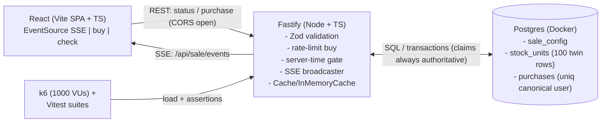

# Flash Sale System — Strategy

> Status: **DECIDED** (from interview, 2026-09-23). This document freezes all
> architectural decisions before the work plan and implementation begin.
> Source of truth: `PROJECT.md`.

## 1. Goal

Build a high-throughput flash sale backend + simple frontend for **one product,
limited stock**, enforcing:

1. Configurable sale window (start/end time) — purchases only inside the window.
2. Limited stock — never oversell, even under 10x oversubscription.
3. One item per user — strictly enforced.
4. Three API capabilities: sale status, purchase attempt, purchase result lookup.
5. Proof of correctness via unit/integration tests + k6 stress test.

Non-goals: real payment, multi-product catalog, user auth, live cloud deploy.
Cloud services may be explained but run locally (Docker) for reviewer
reproducibility.

## 2. Decision Log

| # | Area | Decision | Reason / Argument (owner) |
|---|------|----------|---------------------------|
| 1 | Language | **TypeScript** | Type safety, maintainability, modern standard |
| 2 | Backend | **Fastify (Node.js)** | High throughput, built-in validation, good fit for flash sale |
| 3 | Store | **Postgres via Docker** | Closer to real-world conditions; transactions are visible and honest (not hidden in-memory) |
| 4 | Repo layout | **Simple monorepo** | `backend/` + `frontend/` + diagram + `README.md` at root |
| 5 | Concurrency | **Row-per-unit + `SELECT FOR UPDATE SKIP LOCKED`** | Acts as a queue replacement (see §4); non-blocking claim of one of 100 twin rows |
| 6 | Extra infra | **Postgres-only (no Redis/queue)** | Follows from #5 — the row-lock model already serializes claims, so no extra component is needed (the in-memory `Cache`/`InMemoryCache` lives inside the backend process) |
| 7 | API style | **Minimal REST + SSE** | `GET /api/sale/status`, `GET /api/sale/events` (SSE stream), `POST /api/purchase`, `GET /api/purchase/:userId` |
| 8 | Default sale | **Stock = 100, duration = 10 min** | Realistic for stress test: 1000+ users fighting for 100 units |
| 9 | User ID | **Free-form email w/ Gmail canonicalization** | Stored + UNIQUE-constrained on canonical form (`trim().toLowerCase()`; Gmail only: strip dots, strip `+tag`, `googlemail.com`→`gmail.com`); raw email kept for audit |
| 10 | Errors | **Distinct codes + messages** | `409 already-purchased`, `409 sold-out`, `403 sale-not-active` so the frontend can render specific feedback |
| 11 | Frontend | **Vite SPA + SSE primary, status fallback** | `EventSource` on `/api/sale/events` for live status; `GET /api/sale/status` for initial load + fallback. No SSR/SSG needed for a single-page demo |
| 12 | Unit/integration test | **Vitest + supertest-style (lightweight HTTP assert)** | Fast, pairs well with Vite + Fastify |
| 13 | Stress test | **k6, 1000 VUs vs 100 stock** | 10x oversubscription is sufficient proof: expect exactly 100 successes, 0 oversell |
| 14 | Diagram | **Mermaid in README** | Text-based, renders on GitHub, easy to review and diff |
| 15 | Ops | **docker-compose + Zod validation + purchase rate-limit + open CORS** | One-command run for reviewer; validation + rate-limit protect the hot path |

Open (proposed, to confirm in work plan): rate limit = **10 req/min per IP on
`POST /api/purchase`** (status endpoint unlimited); time source = **server time**;
config via env `SALE_START`, `SALE_END`, `STOCK_QTY`.

## 3. Architecture (Postgres-only)



Single backend instance is enough for the take-home; the design scales
horizontally because correctness lives in **Postgres transactions**, not in
process memory — any number of Fastify replicas can share the same claim
protocol.

## 4. Core Idea: Row-per-Unit as Queue Replacement

Instead of the classic single-counter row (`stock.qty -= 1`), we model **each
unit as its own row**.

### 4.1 Data model

```sql
sale_config(id, product_name, stock_qty, starts_at, ends_at);
stock_units(id, sale_id, status, sold_at);
  -- status: 'available' | 'sold'
  -- 100 twin rows per sale, all 'available' at seed time
purchases(id, sale_id, canonical_user_id UNIQUE, unit_id UNIQUE, raw_user_id, created_at);
  -- UNIQUE(sale_id, canonical_user_id) enforces one-item-per-user
  -- canonical_user_id: trim().toLowerCase(); Gmail only: strip dots in local part,
  --   strip +tag, googlemail.com -> gmail.com
```

### 4.2 Claim protocol (`POST /api/purchase`)

Pre-transaction gates (no transaction opened — fail fast, no rollback needed):

1. **Gate on sale window** (server time, `sale_config` may come from cache):
    if `now < starts_at` or `now > ends_at` → `403 sale-not-active`.
2. **Fast-path repeat-buyer check**: if a `purchases` row exists for
    `(sale_id, canonical user_id)` → `409 already-purchased`. This is an
    optimization so repeat buyers never open a transaction or take locks.

Inside one short Postgres transaction (authoritative path):

1. **Claim a unit** (the queue-replacement step):
   ```sql
   SELECT id FROM stock_units
    WHERE sale_id = $1 AND status = 'available'
    ORDER BY id
    FOR UPDATE SKIP LOCKED
    LIMIT 1;
   ```
   - `FOR UPDATE` locks the chosen row so no other transaction can take it.
   - `SKIP LOCKED` skips rows currently locked by concurrent transactions
     instead of blocking — under 1000-way contention the request fails fast
     (→ `409 sold-out`) rather than piling up behind locks.
2. If no row returned → rollback, `409 sold-out`.
3. Otherwise `UPDATE stock_units SET status='sold', sold_at=now()` +
   `INSERT INTO purchases(sale_id, canonical_user_id, unit_id, raw_user_id)` in
   the **same transaction** → commit, `201 purchased`.

   On commit the server invalidates the status cache and broadcasts the new
   status over SSE (see §5–§6).

Because Postgres transaction is atomic, the number of `sold` rows can never exceed the
number of seeded unit rows: **oversell is structurally impossible**. The claim
path never reads the cache — it always goes to Postgres authoritatively.

### 4.3 Timeout / reclaim semantics

Single-transaction claims need no application timeout or reaper: if a claimer
is slow or crashes before commit, Postgres rolls the transaction back
(statement/lock timeout) and the row stays `available`. The next buyer can
immediately lock it — no orphan state exists. A lock-then-confirm reservation
model with a reaper is documented only as a future extension (§10) and is
**not built** for this take-home.

## 5. API Contract

| Method & Path | Body / Params | Success | Failures |
|---|---|---|---|
| `GET /api/sale/status` | — | `200 { status: upcoming\|active\|ended, stockRemaining, totalStock, startsAt, endsAt, serverTime }` | — (never 4xx; initial load + SSE fallback) |
| `GET /api/sale/events` | SSE (`text/event-stream`) | `200` stream of `event: status` JSON payloads (same shape as status) + `:heartbeat` comment every 15s | — (client reconnects with backoff; falls back to status polling) |
| `POST /api/purchase` | `{ "userId": "email" }` (Zod-validated, canonicalized) | `201 { result: purchased, unitId }` | `400 invalid-userId`, `403 sale-not-active`, `409 already-purchased`, `409 sold-out`, `429 rate-limited` |
| `GET /api/purchase/:userId` | canonicalized path param | `200 { result: purchased, unitId }` | `400 invalid-userId`, `404 not-purchased` |

> Post-freeze footnote: this spec was frozen pre-implementation;
> two contracts changed after the freeze and the code is authoritative.
> Lookup-miss went `200 {result:not-purchased}` → `404 {error:not-purchased}`
> (not-found semantics; `GET /api/purchase/:userId` for an unknown buyer is a
> missing resource, consistent with unknown routes → `404 not-found`).
> Heartbeat went 5s → 15s (`HEARTBEAT_MS=15000` in
> `backend/src/interfaces/http/handlers/api/sale/index.ts`, matching
> `backend/README.md`); 15s keeps NAT/proxy idle-connections alive with
> one-third the idle write traffic.

Notes:

- `stockRemaining` is served through a `Cache` interface (`InMemoryCache`)
  (`getStatus / setStatus / invalidate`) backed by an **in-memory**
  implementation: **TTL 5s + invalidate on every successful purchase**.
  The cache is strictly a read optimization — claims always hit Postgres.
  Swapping to Redis later means implementing the same interface (see §10).
- SSE broadcaster (in-memory `EventEmitter`, single instance) pushes fresh
  status on every purchase commit, window transition, and ~2s tick — one
  `COUNT` query serves all connected clients instead of N polls.
- **Canonicalization is backend-authoritative:** `canonicalizeUserId()` lives in
  the backend (`backend/src/services/purchase/index.ts (canonicalizeUserId)`) and is applied to both
  `POST /api/purchase` bodies and `GET /api/purchase/:userId` params before any
  DB lookup; the Postgres UNIQUE constraint is on `canonical_user_id`. The
  frontend sends the raw email as-is (may `trim()` for UX only) and MUST NOT
  strip Gmail dots/`+tag` — direct callers (curl/k6) get identical enforcement.
- Gmail canonicalization test: `foobar@gmail.com`, `foo.bar@gmail.com`,
  `foobar+baz@gmail.com` → one purchase; the other two → `409
  already-purchased`. Non-Gmail domains get only `trim().toLowerCase()`.
- All timestamps ISO-8601 UTC; window checks use **server time** to avoid
  client-clock skew.
- No idempotency-key header: `POST /api/purchase` is already naturally
  idempotent per user (second call → `409 already-purchased`).

## 6. Frontend Strategy

- **Vite SPA (React + TS)** — no SSR/SSG; a single-page demo (status panel +
  buy form) does not need Next.js-style rendering, and the brief only requires
  React.
- Two panels: sale status (status pill, countdown, remaining/total) + buy form
  (email input, Buy Now, result alert).
- **SSE primary:** `EventSource` on `GET /api/sale/events` for live status;
  initial load + reconnect fallback uses `GET /api/sale/status`. After Buy Now,
  call `GET /api/purchase/:userId` to confirm and render one of: success /
  already-purchased / sold-out / not-active.
- Plain CSS (no UI framework) — function over polish; specific error messages
  from §5 are shown verbatim.

## 7. Testing Strategy

- **Unit (Vitest):** canonicalization (incl. Gmail dots/`+tag`/`googlemail`),
  window gating, error mapping, validation schemas.
- **Integration (Vitest + real Postgres via Docker):** sale lifecycle
  (upcoming → active → ended), one-per-user rejection (incl. Gmail-variant
  second attempt → `409`), sold-out path, SSE event delivery on purchase,
  concurrent purchase attempts against a tiny stock (e.g., 5 units, 50 parallel
  callers → exactly 5 purchases).
- **Stress (k6, `stress/`):** 1000 VUs ramp against 100 units over the active
  window; assertions: `http_req_failed` low (only expected 4xx), exactly 100
  `purchased`, `sold` count ≤ 100, `canonical_user_id` uniqueness holds. Results exported
  to JSON + summarized in README with expected outcome.

## 8. Operations

- `docker-compose.yml`: `postgres` + `backend` + `frontend`; one command
  `docker compose up --build`.
- Env: `SALE_START`, `SALE_END`, `STOCK_QTY` (defaults: now+60s, +10min, 100),
  `DATABASE_URL`, `PORT`, `RATE_LIMIT_BUY` (default 10/min/IP).
- Backend: Zod validation on all inputs, `@fastify/rate-limit` on purchase
  route only, open CORS for demo, Dockerfile + health check.
- Seed script creates `sale_config` + N `available` unit rows idempotently.

## 9. Trade-offs & Why-Not

| Alternative considered | Why rejected |
|---|---|
| In-memory store | Simple but dishonest — hides real transactional behavior the reviewer wants to see |
| Single counter + `UPDATE stock SET qty = qty - 1 WHERE qty > 0` | Correct and simpler, but serializes on one hot row and demonstrates less (no lock-skip behavior); chosen model spreads contention across 100 rows |
| `SELECT FOR UPDATE` without `SKIP LOCKED` | Correct but blocks under contention → latency pile-up and timeouts at 1000 VUs |
| Redis / message queue | Unnecessary once row-locks serialize claims; adds reviewer setup cost. Documented as the scaling path (§10). In-memory `Cache`/`InMemoryCache` behind an interface keeps the Redis migration trivial |
| 3s status polling | Wasteful at 1000 users (~333 rps just for status); replaced by SSE push (one `COUNT` per ~2s tick serves all clients) |
| WS / bidirectional socket | Overkill; sale status is server→client only, SSE is sufficient |
| Lock-then-confirm + reaper | Unneeded complexity while claims are single-transaction; Postgres rollback already reclaims automatically |
| Idempotency-Key header | Redundant — per-user uniqueness already makes purchase idempotent |

## 10. Scaling Path (documented, not built)

If traffic grows 100x:

- Implement `Cache` (`InMemoryCache` today) with **Redis** instead of in-memory (same interface);
  keep Postgres as the source of truth for claims.
- Replace the in-memory SSE `EventEmitter` with **Redis pub/sub** so events fan
  out across Fastify replicas.
- Optionally add a **queue** (BullMQ/SQS) to smooth bursts, with the row-claim
  protocol unchanged inside workers; a lock-then-confirm reservation model with
  a reaper only becomes relevant here.
- The Mermaid diagram in README will show this as a dashed "future" lane.

## 11. Risks

- Docker-dependent tests may be slow on weak laptops → mitigate with small-stock
  integration case + PGHOST override for local Postgres.
- k6 must be installed for stress → provide `stress/README` + `npx`-free
  fallback script note.
- Clock skew in compose → all window checks use backend `now()`; frontend only
  displays server-provided times.

## 12. Next Step

Work plan (backend → frontend → tests → stress → README/diagram) to be proposed
for approval after this strategy is accepted.
